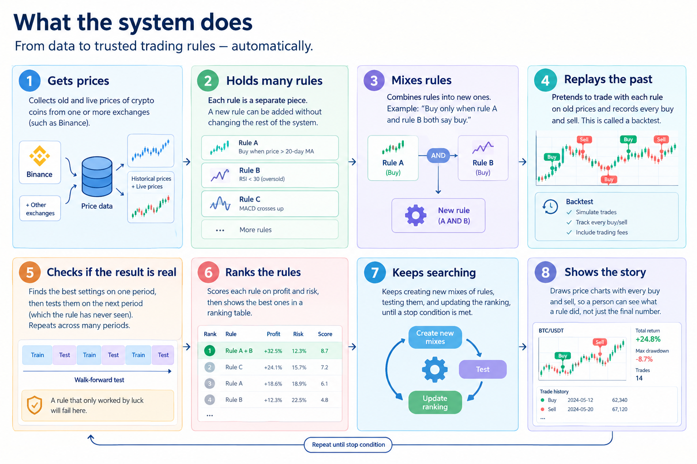

# Vision

## The problem

People who trade crypto coins follow rules to decide when to buy and when to sell.
A rule like this is called a **strategy**. Example: "Buy when the price goes above its 20-day average."

There are hundreds of possible rules, and people often mix several rules together.
This creates two problems:

1. **Testing is slow.** To check one rule, a person must collect old prices and calculate the results by hand.
2. **Good results are often fake.** If you try many rules on the same old prices, some rules will look great just by luck. Some tests also "cheat" by using prices that were not known at that time. These rules then fail in real life.

For more details, read:

- [Actors](../02-requirements/01-actors.md): who uses or touches the system.
- [Problems](../02-requirements/02-problems.md): what each actor struggles with.

## The core question

> **Can we build a system that tests many trading rules automatically, and shows which results we can really trust?**

## What the system does

## In scope

- Old and live crypto prices from one or more exchanges.
- Adding, mixing and testing trading rules.
- Honest testing: no use of future prices, trading fees included, walk-forward test.
- A ranking table and charts.
- News about coins from one or more sources, and whether the news is good or bad for the price.

## Out of scope

- Real money or real trading. Everything is a simulation.
- Proving that any rule makes money.
- Financial advice.
